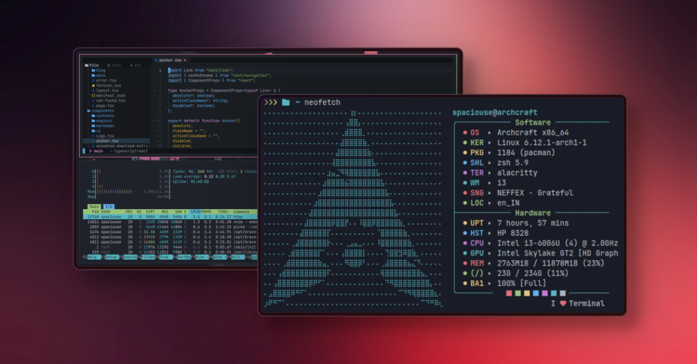

This repository contains my personal configuration for Neofetch, a command-line system information tool written in Bash. Neofetch displays information about your system next to an image, your OS logo, or any ASCII file of your choice.




## Features

- Custom ASCII art
- Detailed system information
- Personalized color scheme
- Optimized for minimalistic display

## Installation

1. Clone the repository:
   ```sh
   git clone https://github.com/spaciousejar/neofetch-conf.git
   cd neofetch-config
   ```

2. Copy the configuration file to your Neofetch config directory:
   ```sh
   cp config.conf ~/.config/neofetch/config.conf
   ```

3. Run Neofetch to see the changes:
   ```sh
   neofetch
   ```

## Customization

Feel free to customize the configuration file (`config.conf`) to suit your preferences. You can modify the ASCII art, colors, and the information displayed by Neofetch.

## Contributing

If you have any suggestions or improvements, please feel free to submit a pull request or open an issue.

## License

This project is licensed under the MIT License. See the [LICENSE](LICENSE) file for more details.
